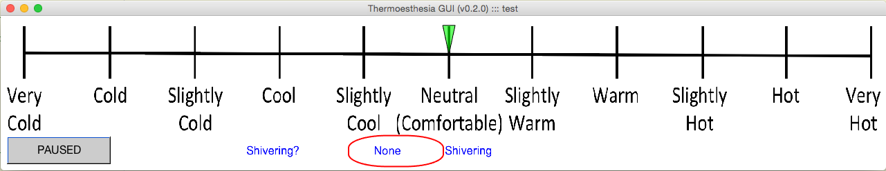

THERMOESTHESIA_GUI
==================
***Version 0.#.#***
~~~~~
%
% tGUI(EXPERIMENT_NAME_STRING)
%
% Opens a Thermoesthesia GUI with figure title EXPERIMENT_NAME_STRING.
%
% If EXPERIMENT_NAME_STRING is not provided or is empty, it is set to TEST
%
% Starts a CSV file with name EXPERIMENT_NAME_STRING_YYYYMMDD_HHMMSS.csv
% in the ./recordings/ folder
%
% CSV file has three columns:
% 1. 's' : for seconds since GUI start (2 decimal places)
% 2. 'level' : integer marker level (integers 0 to 100) ('very cold' to 'very hot')
% 3. 'shiver' : shiver status (0=='none', 1=='shiver')
%
% Only button up events are recorded into the CSV file.
%
% One button is available to study personnel to start/pause recording.
%
% To start a new file, close the GUI and call again
%
% tGUI(EXPERIMENT_NAME_STRING)
%
% Open GUI with custom parameter settings
%
% tGUI(EXPERIMENT_NAME_STRING, GUI_PARAMS)
%
% Return the name of the CSV filename used to store Thermoesthesia values
%
% CSV_FILENAME = tGUI(EXPERIMENT_NAME_STRING)
%
% GUI_PARAMS is a structure with the following fields and default values
%
% gui_params.marker_color = 'g';     % marker color
% gui_params.marker_alpha = 'g';     % marker alpha (transparency) 0.0 to 1.0
% gui_params.txt_fontsize = 16;      % font size for shivering status text
% gui_params.txt_fontname = 'Arial'; % font size for shivering status text
% gui_params.txt_color = 'b';        % font color for shivering status text
% gui_params.shiver_box_color = 'r'; % box (ellipse) color for shivering status
% gui_params.keys_dn = [ double('.37') 28 31 13]; % keys to mover marker down
% gui_params.keys_up = [ double('+48') 29 30];    % keys to mover marker up
% gui_params.keys_shiver = [ double('- 56')];     % keys to change shiver status
% gui_params.gui_timer_period_seconds = 30;   % seconds between auto logging to file
% gui_params.beep_on = true;   % flag to activate audible beep of shiver status (1 or 2 beeps for 'none', 'shiver')
%
% Developed with MATLAB R2014b
%
% Supported by a grant from the National Institutes of Health (NIH), National
% Institute of Diabetes and Digestive and Kidney Diseases (NIDDK) - R01DK105371
%
% Usage notes:
%
% * Be sure to click Thermoesthesia GUI window with mouse after beginning
%   to record so that button events move marker and shiver status box.
%
% Example:
%
%   % open figure black background to make Thermoesthesia GUI clearly visible
%   hf555 = figure(555); set(hf555,'Color',[0 0 0],'menubar','none');
%
%   % open Thermoesthesia GUI with default settings
%   tGUI('TEST');
~~~~~
***Version 1.#.#***
~~~~~
% tGUI(EXPERIMENT_NAME_STRING)
%
% Reads input from two LM35DZ temperature sensors connected to an Arduino Uno.
% When the sensors' values are approximately equal (+/- 2 degrees Celsius), 
% opens a Thermoesthesia GUI (tGUI) with figure title EXPERIMENT_NAME_STRING.
%
% If EXPERIMENT_NAME_STRING is not provided or is empty, it is set to TEST
%
% Starts a CSV file with name EXPERIMENT_NAME_STRING_YYYYMMDD_HHMMSS.csv
% in the ./recordings/ folder
%
% CSV file has six columns:
% 1. 's' : for seconds since GUI start (2 decimal places)
% 2. 'level' : integer marker level (integers 0 to 100) ('very cold' to 'very hot')
% 3. 'shiver' : shiver status (0=='none', 1=='shiver')
% 4. 'sensor 1' : temperature read by first temperature sensor 
% 5. 'sensor 2' : tempreature read by second temperature sensor
% 6. 'delta t' : difference between sensor 1 and sensor 2 temperature readings
%
% Only button up events are recorded into the CSV file.
%
% One button is available to study personnel to start/pause recording.
%
% To start a new file, close the GUI and call again
%
% tGUI(EXPERIMENT_NAME_STRING)
%	
% Open GUI with custom parameter settings	
%	
% tGUI(EXPERIMENT_NAME_STRING, GUI_PARAMS)
%
% Return the name of the CSV filename used to store Thermoesthesia values
%
% CSV_FILENAME = tGUI(EXPERIMENT_NAME_STRING)
%
% GUI_PARAMS is a structure with the following fields and default values
%
% gui_params.marker_color = 'g';     % marker color
% gui_params.marker_alpha = 'g';     % marker alpha (transparency) 0.0 to 1.0
% gui_params.txt_fontsize = 16;      % font size for shivering status text
% gui_params.txt_fontname = 'Arial'; % font size for shivering status text
% gui_params.txt_color = 'b';        % font color for shivering status text
% gui_params.shiver_box_color = 'r'; % box (ellipse) color for shivering status
% gui_params.keys_dn = [ double('.37') 28 31 13]; % keys to mover marker down
% gui_params.keys_up = [ double('+48') 29 30];    % keys to mover marker up
% gui_params.keys_shiver = [ double('- 56')];     % keys to change shiver status
% gui_params.gui_timer_period_seconds = 30;   % seconds between auto logging to file
% gui_params.beep_on = true;   % flag to activate audible beep of shiver status (1 or 2 beeps for 'none', 'shiver')
%
%
% The analog data output from the LM35DZ is in mV/C (millivolts/Celsius)
%
% Transfer function: V_out = 10mV/°C * T    -> where T is temperature in °C
% LM35 datasheet conversion Example:
%   V_OUT = 250 mV at 25°C
%
%
% Developed with MATLAB R2018a
%
% Supported by a grant from the National Institutes of Health (NIH), National
% Institute of Diabetes and Digestive and Kidney Diseases (NIDDK) - R01DK105371
%
% Usage notes:
%
% * Be sure to click Thermoesthesia GUI window with mouse after beginning
%   to record so that button events move marker and shiver status box.
%
% Example:
%
%   % open figure black background to make Thermoesthesia GUI clearly visible	
%   hf555 = figure(555); set(hf555,'Color',[0 0 0],'menubar','none');
%
%   % open Thermoesthesia GUI with default settings
%   tGUI('TEST');
%
%
~~~~~

THERMOESTHESIA_PLOT
===================
~~~~~
%
% [DATA_STRUCT] = THERMOESTHESIA_PLOT(CSV_FILENAME)
%
% Reads and plots a thermoesthesia data in CSV file CSV_FILENAME.
%
% DATA_STRUCT contains 3 fields which are column vectors of the same length
%
% data_struct.s      % time in seconds
% data_struct.level  % thermoestesia level (integers 0 to 100) ('very cold' to 'very hot')
% data_struct.shiver % shiver status (0=='none', 1=='sporadic', 2=='constant')
%
% Developed with MATLAB R2014b
%
% Supported by a grant from the National Institutes of Health (NIH), National
% Institute of Diabetes and Digestive and Kidney Diseases (NIDDK) - R01DK105371
%
% Example:
%
%   % open Thermoesthesia GUI with default settings
%   csv_filename = Thermoesthesia_GUI('TEST');
%
%   % plot thermoesthesia values
%   data_struct = Thermoesthesia_Plot(csv_filename);
%
~~~~~

Description
===========
***Version 0.#.#***  Graphical user interface (GUI) to capture a human subject's perception and ability to distinguish differences of temperature (thermoesthesia). The tool uses a graphic analog scale (Figure 1) to implement a MATLAB-based GUI (Figure 2) in which the subject controls a marker on the scale. The subject also indicates shivering status with a box/ellipse with options "None" or "Shivering".
Graphical user interface (GUI) to capture a human subject's perception and ability to distinguish differences of temperature (thermoesthesia). The tool uses a graphic analog scale (Figure 1) to implement a MATLAB-based GUI (Figure 2) in which the subject controls a marker on the scale. The subject also indicates shivering status with a box/ellipse with options "None" or "Shivering".

***Version 1.#.#***  Integrates real-time feedback from two thermistors connected to an Arduino microcontroller (Figure 3) to determine if the subject is at thermoneutral, which is then used as input to start the graphical user interface developed in Version 0.#.#. For example, the thermistors can be attached to the middle finger and inner forearm of the subject. If the skin temperature of the two locations is approximately equal, then the subject is considered to be at thermoneutral. For more information about the Arduino/thermistor circuit diagram and parts list, please refer to Figure 4. 

Figure 1. Thermoesthesia Scale
====================

Figure 2. GUI Screenshot
==============

Figure 3. Arduino microcontroller
==============

Figure 4. Arduino circuit diagram
==============

Example Plots
=============

Habituation
-----------

Cyclic Cooling
--------------

Grant Support
-------------
Supported by a grant from the National Institutes of Health (NIH), National Institute of Diabetes and Digestive and Kidney Diseases (NIDDK) - R01DK105371
